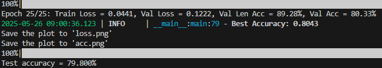
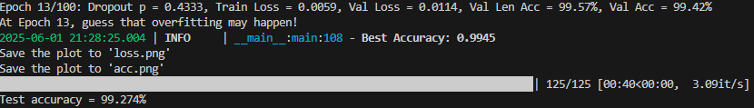
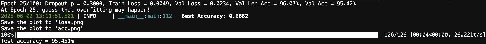
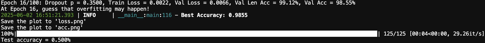

# AI_Final_Project_Verification_Code

## Our Revision Report : [Revision Report](https://docs.google.com/presentation/d/1KrS4LxxDu5PNEDDL7Kq2CilWm1ZMtfKtREevRrvxRUw/edit#slide=id.p)
## Dataset Used Source : [Kaggle - train-num2-var by bhh258](https://www.kaggle.com/datasets/bhh258/train-num2-var)
## 📦 Dataset download process
(The dataset used in this repository is not included in the GitHub repository due to size and license constraints. Please follow the instructions below to download it.)

### 1. Install Kaggle CLI tools：
   ```bash
   pip install kaggle
   ```
### 2. Install kaggle.json (If you've already done this before, just skip this step.)
### 3-1. Download Kaggle Dataset
#### 3-1-1. Manual download
   ```bash
   kaggle datasets download -d bhh258/train-num2-var --unzip
   # You might be prompted to accept the license by typing "y" or "yes".
   ```
#### 3-1-2. Automatic download (recommend)
   ```bash
      python download_kaggle_dataset.py
      # The script will handle download, unzip, and license agreement automatically.
   ```
### 3-2.  Download our own Dataset
#### Automatic download (recommend)
   ```bash
      python download_ourown_dataset.py
      # The script will handle download, unzip, and license agreement automatically.
   ```
### 4-1. Split dataset (Kaggle Dataset)
   ```bash
      python split_dataset.py --dataset 1
      # This script will automatically split the downloaded dataset into training, validation, and test sets (by length and with a fixed seed for reproducibility).
   ```
### 4-2. Split dataset (Our own Dataset)
   ```bash
      python split_dataset.py --dataset 2
      # This script will automatically split the downloaded dataset into training, validation, and test sets (by length and with a fixed seed for reproducibility).
   ```
##  Training a model for recognizing verification codes
### 1. Install environment
We recommend using Python 3.8 or above.
#### Use GPU (recommend)
Please install the correct version of PyTorch that matches your system’s CUDA version (instructions not provided here).
#### Using CPU Only (not recommend)
You can use :
```bash
pip install torch torchvision torchaudio
```
#### Other libraries
All other required libraries are listed in "requirements.txt".
You can install them with the following command :
```bash
pip install -r requirements.txt
```
### 2-1. Start Recognizing (Use Kaggle Dataset)
```bash
python Recognize.py --dataset 1
# Average runtime: approximately 1 hour
```
### Results: Test accuracy is about 84%


### 2-2. Start Recognizing (Use our own Dataset)
```bash
python Recognize.py --dataset 2
# Average runtime: approximately 30 minutes
```
### Results: Test accuracy is about 99%


##  Generating CAPTCHA images and recognizing
### 1. Train cGAN model and generate dataset
```bash
python cGAN.py
```
### 2. Split dataset
```bash
python split_dataset.py --dataset 3
# This script will automatically split the downloaded dataset into training, validation, and test sets (by length and with a fixed seed for reproducibility).
```
### 3. Start recognizing
```bash
python Recognize.py --dataset 3
# Average runtime: approximately 30 minutes
```
### Results: Test accuracy is about 95%


##  Using our own dataset for training, and using cGAN-generated dataset for testing
Note:
Please ensure that Dataset 2 and Dataset 3 have been generated.
To generate Dataset 2, please execute steps 3-2 and 4-2 in the "Dataset download process" section.
To generate Dataset 3, please execute steps 1 and 2 in the "Generating CAPTCHA images and recognizing" section.

### 1. Start recognizing
```bash
python Recognize.py --dataset 4
# Parameter 4 indicates the train and validation sets use images from Dataset 2, while the test set uses images from Dataset 3.
# Average runtime: approximately 20 minutes
```
### Results: Test accuracy is about 0.5%
